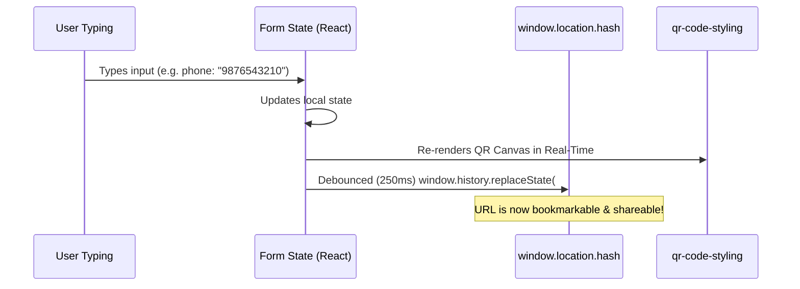
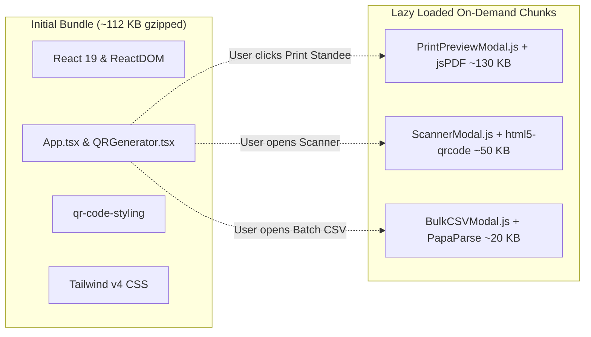
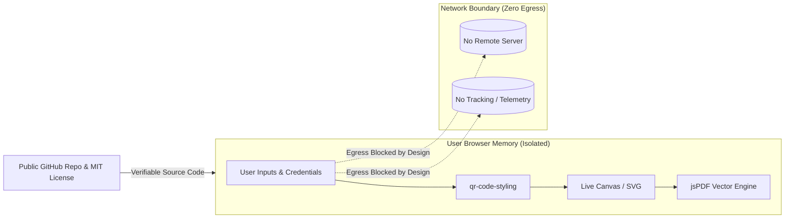
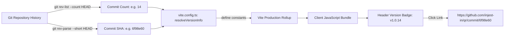

# Architecture & Engineering Guide: QR

This document outlines the technical architecture, component hierarchy, state flow, bundling strategy, and extension patterns for **QR**.

---

## 1. High-Level Architecture Diagram

```mermaid
graph TD
    User([User Browser / Mobile]) --> AppShell[App Shell - App.tsx]
    
    subgraph Routing ["HashRouter & Deeplink Layer"]
        AppShell --> RouteParser[parseRouteFromHash / parseToolFromHash]
        RouteParser -->|Route = /pay| PayGate[DualActionGate.tsx]
        RouteParser -->|Route = /scan| Scanner[ScannerModal.tsx - Lazy]
        RouteParser -->|Route = /staff| StaffScanner[ScannerModal.tsx - Staff Mode]
        RouteParser -->|Route = /batch| BatchCSV[BulkCSVModal.tsx - Lazy]
        RouteParser -->|Default Route| Generator[QRGenerator.tsx]
    end

    subgraph GeneratorEngine ["Generator & Real-Time Sync"]
        Generator --> TierNav[Tier Selector: Simple | Business | Advanced]
        TierNav --> ToolInputs[Active Tool Form Inputs]
        ToolInputs -->|250ms Debounce| HashSync[serializeToolToHash -> window.history.replaceState]
        ToolInputs --> ProtocolEngine[qrParsers.ts Protocol Generators]
        ProtocolEngine --> Scannability[scannabilityLinter.ts]
        ProtocolEngine --> QRCodeCore[qr-code-styling Engine]
        QRCodeCore --> CanvasOutput[(Vector / Canvas DOM)]
        QRCodeCore -->|Print Action| PrintStudio[PrintPreviewModal.tsx - Lazy / jsPDF]
    end

    subgraph ClientStorage ["Zero-Persistence Client Storage"]
        ThemeEngine[Theme Engine - theme.ts] <-->|Read / Write| LocalTheme[(localStorage: qr_theme_preference)]
        SettingsModal[QRSettingsModal.tsx] <-->|Read / Write| LocalStyling[(localStorage: qr_styling_preferences)]
    end
```

---

## 2. Component Hierarchy & File Map

```text
src/
├── main.tsx                    # React 19 entry point
├── App.tsx                     # Top-level shell, header, navigation, route dispatch
├── index.css                   # Tailwind CSS v4 setup, dark variants, checkerboard styles
├── types/
│   └── index.ts                # TypeScript interfaces, unions, payloads, QROptions
├── components/
│   ├── QRGenerator.tsx         # Central multi-tier form, canvas manager & export actions
│   ├── DualActionGate.tsx      # Customer payment landing page (/pay)
│   ├── CountryCodeSelect.tsx   # Localized country picker with flag emoji and dial codes
│   ├── QRSettingsModal.tsx     # Precision QR styling, dot shapes, and transparency dialog
│   ├── MadeInBharatBadge.tsx   # Authentic Indian Tricolor and 24-spoke Ashoka Chakra vector badge
│   ├── ThemeToggle.tsx         # Light / Dark / System mode segmented toggle & mobile dropdown
│   ├── PWAInstallModal.tsx     # iOS Safari Add-to-Home-Screen interactive guide
│   ├── ScannerModal.tsx        # [Lazy] Camera and image file QR scanner
│   ├── BulkCSVModal.tsx        # [Lazy] Batch generation from CSV files
│   ├── PrintPreviewModal.tsx   # [Lazy] Standee & tent card PDF preview and exporter
│   └── SpotlightTour.tsx       # Interactive zero-dependency guided spotlight onboarding tour
└── utils/
    ├── countryCodes.ts         # List of world countries and auto-detection algorithm
    ├── qrParsers.ts            # Protocol generators, deeplink serializers & parsers
    ├── scannabilityLinter.ts   # WCAG contrast calculator and scannability analyzer
    └── theme.ts                # Light / dark / system theme application and persistence
```

---

## 3. Data Flow & URL Synchronization Cycle

Every keystroke in the generator triggers a non-destructive URL hash update:



When a user loads or refreshes a URL with hash parameters:
1. `initialHashData` runs `parseToolFromHash()`.
2. Extracts tool route (e.g., `wifi`) and query parameters (e.g., `ssid=OfficeWiFi`).
3. Form states initialize directly with parsed values.
4. Canvas renders populated payload on the first tick with zero delay.

---

## 4. Code Splitting & Performance Budget

To maintain rapid First Contentful Paint (FCP) and keep the initial bundle lightweight (< 115 KB gzipped), heavy libraries are dynamically imported using React `lazy()` and dynamic `import()`:



---

## 5. Reverse Ingestion Schema Parsing (Staff Mode)

When scanning an unknown QR code, `parseDecodedQR()` in `src/utils/qrParsers.ts` performs deterministic schema classification:

```mermaid
graph TD
    RawScan[Raw Scanned QR String] --> CheckJSON{Starts with '{' or '['?}
    CheckJSON -->|Yes| ParseJSON[Parse JSON & Recursively Flatten Keys]
    CheckJSON -->|No| CheckSN{Contains 'service-now.com'?}
    CheckSN -->|Yes| ParseSN[Parse sysparm_query & sysparm_variable_values]
    CheckSN -->|No| CheckWifi{Starts with 'WIFI:'?}
    CheckWifi -->|Yes| ParseWifi[Extract SSID, Password, Encryption, Hidden]
    CheckWifi -->|No| CheckUPI{Starts with 'upi://pay'?}
    CheckUPI -->|Yes| ParseUPI[Extract Payee VPA, Name, Amount, Note]
    CheckUPI -->|No| CheckVCard{Starts with 'BEGIN:VCARD'?}
    CheckVCard -->|Yes| ParseVCard[Extract FN, Phone, Email, Org, Title]
    CheckVCard -->|No| CheckMailto{Starts with 'mailto:'?}
    CheckMailto -->|Yes| ParseMailto[Extract Email, Subject, Body]
    CheckMailto -->|No| CheckTel{Starts with 'tel:'?}
    CheckTel -->|Yes| ParseTel[Extract Telephone Number]
    CheckTel -->|No| CheckURL{Starts with 'http://' or 'https://'?}
    CheckURL -->|Yes| ParseURL[Web Link Action]
    CheckURL -->|No| ParseText[Plain Text Output]
```

---

## 6. How to Add a New QR Tool (Developer Guide)

To introduce a new QR tool (e.g. `Spotify Playlist`, `Cryptocurrency Wallet`, or `SMS`):

### Step 1: Add Types in `src/types/index.ts`
1. Add payload interface:
   ```typescript
   export interface SMSPayload {
     phone: string;
     message?: string;
   }
   ```
2. Add tool identifier to `QRMode`:
   ```typescript
   export type QRMode = ... | 'sms';
   ```

### Step 2: Implement Protocol Generator in `src/utils/qrParsers.ts`
```typescript
export function generateSMSUrl(payload: SMSPayload): string {
  if (!payload.phone.trim()) return '';
  return `sms:${payload.phone.trim()}${payload.message ? `?body=${encodeURIComponent(payload.message)}` : ''}`;
}
```

### Step 3: Add Hash Serialization & Deserialization in `qrParsers.ts`
Add the tool's mapping to `parseToolFromHash()` and `syncHashToUrl()` in `QRGenerator.tsx`.

### Step 4: Add Form UI in `src/components/QRGenerator.tsx`
1. Add tab button under the appropriate tier (Simple, Medium, or Advanced).
2. Add input fields with clear placeholders and country picker if applicable.
3. Wire payload to `rawPayload` switch statement.

### Step 5: Verify Build
```bash
fnm env --use-on-cd | Out-String | Invoke-Expression; npm run build
```
Build will verify typing and emit optimized production chunks automatically!

---

## 7. Open Source Trust & Security Model



1. **Permissive Open Source:** Licensed under the MIT License (`LICENSE`), encouraging community audits, forks, and integrations.
2. **Cryptographic & Architectural Proof:** The repository contains zero backend endpoints, tracking pixels, or external persistence layers.
3. **Auditable Egress:** All state mutations and network activity can be verified in real time via the browser's DevTools Network tab.

---

## 8. Dynamic Build-Time Versioning Architecture



1. **Monotonic Progression:** Instead of requiring manual version increments in `package.json`, every commit automatically increments the build counter (`v1.0.<commits>`).
2. **Global TypeScript Invariants:** Global constants `__APP_VERSION__`, `__COMMIT_HASH__`, and `__BUILD_TIME__` are typed in `src/types/index.ts` and inlined at compile time with zero runtime overhead.
3. **CI Pipeline Contract:** `.github/workflows/deploy.yml` sets `fetch-depth: 0` during checkout so the full commit history is available to the runner when generating release builds.

---

## 9. Progressive Web App (PWA) Lifecycle Architecture

```mermaid
graph TD
    Browser[Browser Window Load] --> CheckMode{Is Standalone PWA?}
    CheckMode -->|Yes: display-mode: standalone| HideInstall[Hide All Install Buttons]
    CheckMode -->|No| CheckPlatform{Platform Check}
    
    CheckPlatform -->|iOS Safari| EnableIOSGuide[Enable Install Button -> Opens PWAInstallModal.tsx]
    CheckPlatform -->|Chromium / Android / Desktop| ListenPrompt[Listen to beforeinstallprompt event]
    
    ListenPrompt --> StashPrompt[Capture & Stash DeferredPrompt Event]
    StashPrompt --> ShowButtons[Render Desktop & Mobile Install App Buttons]
    
    ShowButtons -->|User clicks Install| PromptNative[deferredPrompt.prompt()]
    PromptNative --> CheckChoice{User Choice?}
    CheckChoice -->|Accepted| AppInstalled[appinstalled Event -> Hide Buttons]
    CheckChoice -->|Dismissed| KeepAvailable[Keep Install Button Available]
```

1. **Zero Intrusion:** The application never displays annoying automatic popups or banners. Installation buttons are cleanly placed in the header and tools menu.
2. **Cross-Platform Parity:** Works seamlessly on Android/Chrome via the native install prompt, and on iOS via a custom Apple-styled step-by-step visual sheet.
